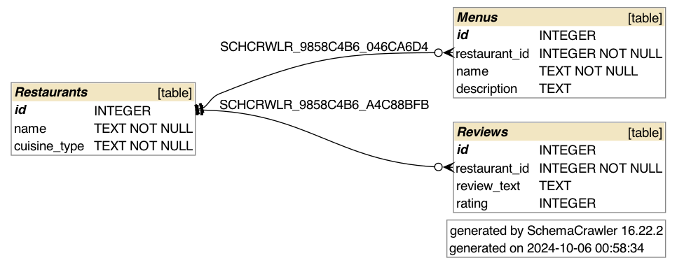

# Natural Language SQL Project

## Restaurants Menu Recommendation Database
This is an interface designed to give recommendations about restaurant menus using natural language queries.

## Overview
This project provides a recommendation system for different types of restaurants—Korean, Chinese, Japanese, and Western—based on a user-selected cuisine type. It uses an SQLite database to store restaurant, menu, and review data. Additionally, it integrates GPT-3.5 to provide detailed descriptions of menu items upon user request, creating a rich and interactive user experience.



## Project Overview
This project provides a recommendation system for different types of restaurants—Korean, Chinese, Japanese, and Western—based on a user-selected cuisine type. It uses an SQLite database to store restaurant, menu, and review data. Additionally, it integrates GPT-3.5 to provide detailed descriptions of menu items upon user request, creating a rich and interactive user experience.

## Files Included
- **setup_database.py**: Sets up the SQLite database, including creating tables for Restaurants, Menus, and Reviews, and inserts sample data.
- **menu_recommender.py**: Handles user interaction to recommend a restaurant and display available menu items. It also provides the option to view reviews for the selected restaurant.
- **chatgpt_integration.py**: Uses the OpenAI API to provide additional information about a specific menu item. Remember to keep your OpenAI API key and OrgID private (not shared in this repository).
- **main.py**: The main program that integrates the functionalities from other scripts to provide a complete user experience.
- **korean_restaurants.db**: SQLite database file that stores data related to restaurants, menus, and reviews. (If using SQLite)
- **README.md**: Provides information on the project, how to run it, and what it entails.
- **schema.png**: Diagram of the database schema, showing relationships between tables.

## Purpose of the Database
The SQLite database stores information about different types of restaurants, their menu items, and customer reviews. It allows the recommendation system to quickly query and provide relevant information to the user, such as which restaurant serves a specific type of cuisine and what menu items are available at each restaurant.

## Schema Picture
The database consists of three tables:
1. **Restaurants**: Stores restaurant details, including name and cuisine type.
2. **Menus**: Stores information about menu items available at each restaurant.
3. **Reviews**: Stores customer reviews and ratings for each restaurant.

## Sample Questions and Queries

### Successful Query Example 1: Finding Korean Restaurants
**User Question**: *"Recommend me a Korean restaurant."*

**SQL Query**:
```sql
SELECT id, name FROM Restaurants WHERE cuisine_type = 'Korean';
```
Response:
- Kimchi House

Explanation: This query successfully returns the list of Korean restaurants stored in the database, providing a selection option to the user.

### Successful Query Example 2: Getting the Menu of a Specific Restaurant
**User Question**: *"What dishes are available at Kimchi House?"*

**SQL Query**:
```sql
SELECT name, description FROM Menus WHERE restaurant_id = (SELECT id FROM Restaurants WHERE name = 'Kimchi House');
```
Response:
- Kimchi Stew: Spicy kimchi stew

Explanation: This query returns the list of menu items for the selected restaurant, allowing the user to see what dishes are offered.

### Unsuccessful Query Example: Italian Restaurants
**User Question**: *"Show me Italian restaurants."*

**SQL Query**:
```sql
SELECT id, name FROM Restaurants WHERE cuisine_type = 'Italian';
```
Response:
- No restaurants available for the selected cuisine.

Explanation: Since there are no Italian restaurants in the database, the query returns no results, and the program informs the user that no such restaurants are available.

## Prompting Strategies Used
In this project, different prompting strategies were experimented with to optimize the responses from GPT-3.5:

 - Direct Questioning: Simple prompts such as "Describe [menu name]" were used initially. This provided concise, straightforward responses but lacked context, leading to brief descriptions.

- Contextual Prompts: Adding more context to the prompt, like "Can you describe the Korean dish called '[menu name]' in detail?" led to more informative and detailed answers. This strategy improved the response quality significantly, as GPT-3.5 provided cultural context, typical ingredients, and flavor profiles.

- Follow-up Prompts: Using follow-up questions such as "What ingredients are typically used?" or "Is this dish spicy?" allowed for more specific answers tailored to the user’s interests. These contextual follow-ups provided depth to the interaction and made the responses more relevant to the user's needs.

The difference between these strategies was noticeable in the depth and specificity of the responses. Contextual prompts and follow-up questions tended to provide more valuable and informative responses compared to simple, direct questions.# Natural_Language_sql_project
